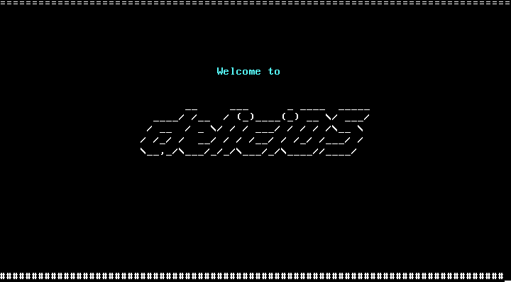
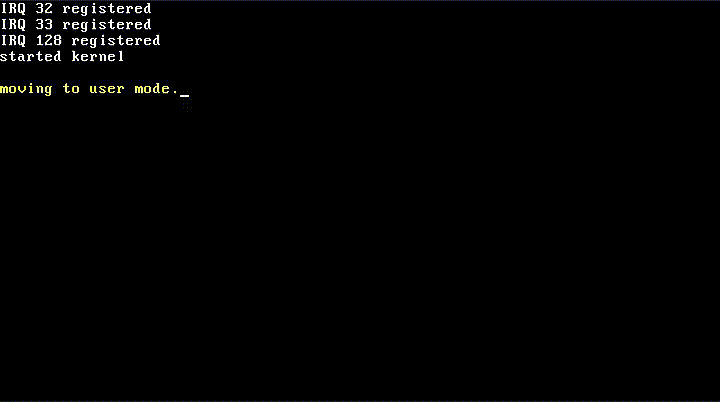
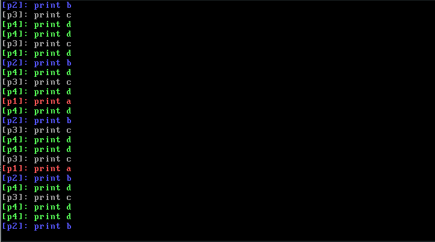
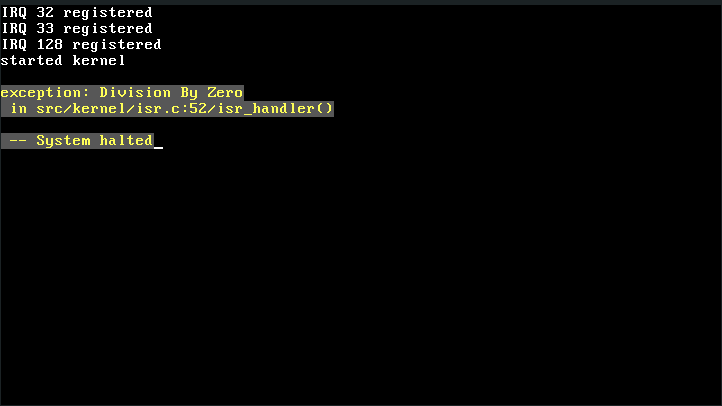

# DeliciOS

[[中文]](./README.zh.md)

DeliciOS (homonym "delicious") is a simple 64-bit Operating System kernel written by C11.

Its Bootloader uses GRUB, and it already has some basic kernel features:

- Process Management
- Memory Management
- System call (soft interrupt)
- Keyboard input
- Text output (console)

Following the principle of "just for fun", I think it also needs the following features:

- SMP
- File System (maybe VFS)
- Socket (TCP)

# Building DeliciOS

DeliciOS can be compiled on 64-bit Linux or MacOS.

Run following command to build the `kernel.iso`.

```shell
make
```

or

```shell
make x86_64.iso
```

When the `kernel.iso` has been built. Use following command to run Qemu.

```shell
qemu-system-x86_64 ./dist/release/x86_64/kernel.iso
```

Then you can see:



# Playing

### Boot DeliciOS



### Run the Multiprocess Program

code:

```c
// the mock user program it's written like the program on Linux.
//
// following is an example of a multiprocess program.
// ps: the "fork()" is a "system call" of create a child process in kernel.
static noreturn void mock_user_program() {
  if (!fork()) {
    if (!fork()) {
      if (!fork()) {
        while (1) {
          console_set_foreground_color(CONSOLE_LIGHT_GREEN);
          printf("[p4]: print d\n");
          msleep(250);
        }
      }
      while (1) {
        console_set_foreground_color(CONSOLE_LIGHT_GRAY);
        printf("[p3]: print c\n");
        msleep(500);
      }
    }
    while (1) {
      console_set_foreground_color(CONSOLE_LIGHT_BLUE);
      printf("[p2]: print b\n");
      msleep(750);
    }
  }
  while (1) {
    console_set_foreground_color(CONSOLE_LIGHT_RED);
    printf("[p1]: print a\n");
    msleep(1000);
  }
}
```

console output:



### Exception Handler

code:

```c
printk("started kernel\n");
// division by zero
i32 a = 10 / (get_cs() >> 30);
```

console output:



# Contributing

Contributions are welcome and encouraged, provided your code is of sufficient quality.

## Issues:

### High Priority

- **[Process]** Now, process switching is not using kernel stack switching.
  Its current solution is similar to TSS, which needs to be changed to use kernel stack switching. [sched.c](./src/kernel/sched.c)
- **[Memory]** A "General Protection" exception will appear if the DPL of the CS (code segment) and DS (data segment)
  in user space settings to 3. (The current DPL settings to 0) [gdt.c](./src/arch/x86_64/gdt.c)
- **[Memory]** Implement paging algorithm on page fault. 
  Now, the virtual address is equal to the physical address. [page.c](./src/mm/page.c)

### Low Priority

- **[Console]** Use the daemon process to control the console.
- **[Chore]** Change the x86 assembly to AT&T and remove NASM.

# Future

I hope it can support earlier versions of Shell and GCC. (like a modern Linux 0.01)

And in the end, We will refactor it. Write all core code in the stupidest (simplest) way.

I hope to help some lost person who loves the operating system (such as me).

# Acknowledgement

###### no rank

- [Linux](https://github.com/torvalds/linux)
- [SynestiaOS](https://github.com/SynestiaOS/SynestiaOS)
- [Simple-XX/SimpleKernel](https://github.com/Simple-XX/SimpleKernel)
- [xinu-os/xinu](https://github.com/xinu-os/xinu)
- [pritamzope/OS](https://github.com/pritamzope/OS)
- To be added...(too much)

# License

DeliciOS is under the GPLv2 License. See the [LICENSE](./LICENSE) file for details.
