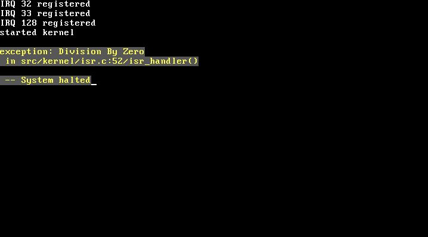

# DeliciOS

DeliciOS (谐音 "delicious") 是一个使用 C11 编写的简单的 64-bit 操作系统内核。

它使用 GRUB 作为引导程序，并且，它目前已拥有一些基本的内核功能：

- 进程管理
- 内存管理
- 系统调用 (软中断)
- 键盘输入
- 文本输出 (控制台)

遵循 "Just for fun" 的原则，我认为它还需要以下几个功能：

- SMP
- 文件系统 (也许是 VFS)
- Socket (TCP)

# Building DeliciOS

可以在 64-bit 的 Linux 或 MacOS 上编译 DeliciOS。

运行以下命令来构建 `kernel.iso`。

```shell
make
```

or

```shell
make x86_64.iso
```

当 `kernel.iso` 已经构建成功。使用以下命令运行 Qemu。

```shell
qemu-system-x86_64 ./dist/release/x86_64/kernel.iso
```

然后你能够看到:


# Playing

### 启动 DeliciOS


### 运行多进程程序

代码


画面


### 异常处理

代码


画面



# Future

最终我希望能够支持早期版本的 Shell 和 GCC. (就像是一个现代的 Linux 0.01)

# 致谢

- [Linux](https://github.com/torvalds/linux)
- [SynestiaOS](https://github.com/SynestiaOS/SynestiaOS)
- [Simple-XX/SimpleKernel](https://github.com/Simple-XX/SimpleKernel)
- [xinu-os/xinu](https://github.com/xinu-os/xinu)
- [pritamzope/OS](https://github.com/pritamzope/OS)
- 待整理...(有点多)

# License

GNU General Public License, version 2
