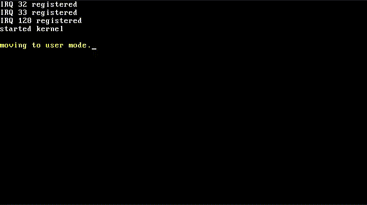

# DeliciOS

DeliciOS (谐音 "delicious") 是一个使用 C11 编写的简单的 64-bit 操作系统内核。

它使用 GRUB 作为引导程序，并且，它目前已拥有一些基本的内核功能：

- 进程管理
- 内存管理
- 系统调用 (软中断)
- 键盘输入
- 文本输出 (控制台)

遵循 "Just for fun" 的原则，我认为它还需要以下几个功能：

- SMP
- 文件系统 (也许是 VFS)
- Socket (TCP)

# Building DeliciOS

可以在 64-bit 的 Linux 或 MacOS 上编译 DeliciOS。

运行以下命令来构建 `kernel.iso`。

```shell
make
```

or

```shell
make x86_64.iso
```

当 `kernel.iso` 已经构建成功。使用以下命令运行 Qemu。

```shell
qemu-system-x86_64 ./dist/release/x86_64/kernel.iso
```

然后你能够看到:


# Playing

### 启动 DeliciOS


# Playing

### Boot DeliciOS



### Run the Multiprocess Program

代码:

```c
// the mock user program it's written like the program on Linux.
//
// following is an example of a multiprocess program.
// ps: the "fork()" is a "system call" of create a child process in kernel.
static noreturn void mock_user_program() {
  if (!fork()) {
    if (!fork()) {
      if (!fork()) {
        while (1) {
          console_set_foreground_color(CONSOLE_LIGHT_GREEN);
          printf("[p4]: print d\n");
          msleep(250);
        }
      }
      while (1) {
        console_set_foreground_color(CONSOLE_LIGHT_GRAY);
        printf("[p3]: print c\n");
        msleep(500);
      }
    }
    while (1) {
      console_set_foreground_color(CONSOLE_LIGHT_BLUE);
      printf("[p2]: print b\n");
      msleep(750);
    }
  }
  while (1) {
    console_set_foreground_color(CONSOLE_LIGHT_RED);
    printf("[p1]: print a\n");
    msleep(1000);
  }
}
```

控制台输出:


### Exception Handler

代码:

```c
printk("started kernel\n");
// division by zero
i32 a = 10 / (get_cs() >> 30);
```

控制台输出:


# Future

最终我希望能够支持早期版本的 Shell 和 GCC. (就像是一个现代的 Linux 0.01)

# 致谢

###### 不分先后

- [Linux](https://github.com/torvalds/linux)
- [SynestiaOS](https://github.com/SynestiaOS/SynestiaOS)
- [Simple-XX/SimpleKernel](https://github.com/Simple-XX/SimpleKernel)
- [xinu-os/xinu](https://github.com/xinu-os/xinu)
- [pritamzope/OS](https://github.com/pritamzope/OS)
- 待整理...(有点多)

# License

GNU General Public License, version 2
